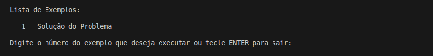
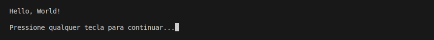

# < Nome Completo >

< `enunciado` >

## Detalhes Gerais

- **Versão**: < `número da tag` >
- **Conceito aplicado:** < `nome do conceito` >

## Descrição da Versão

```bash
< descricao detalhada da versao >
```

## Exemplo(s) de Execução



(Solução do Problema)

