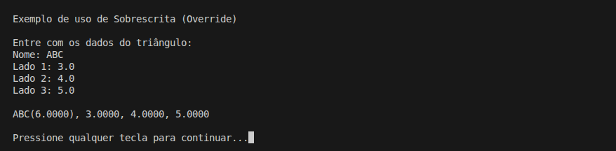
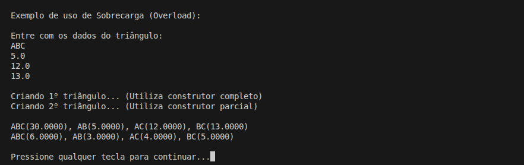
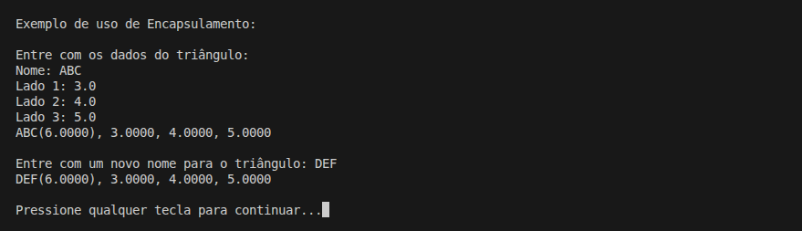

# Comparação das Áreas de Dois Triângulos

Ler as medidas dos lados de dois triângulos, considerando medidas válidas.

Em seguida:
- Calcular a área de cada triângulo
- Exibir os valores das áreas
- Informar qual triângulo possui a maior área

A área de um triângulo com lados `S1`, `S2` e `S3` é calculada pela **fórmula de Heron**:

```bash
p = (S1 + S2 + S3) / 2
area = RaizQ(p * (p - S1) * (p - S2) * (p - S3))
```

## Detalhes Gerais

- **Versão**: 0.8
- **Conceito aplicado:** Tipos Anuláveis

## Descrição da Versão

```bash

Introduz suporte a tipos anulaveis no fluxo de entrada
da aplicacao.

O metodo CreateTriangle passa a aceitar entradas vazias
do usuario, convertendo-as para valores nulos por meio
do metodo ParseDoubleOrNull.

Os valores nulos sao tratados pelo construtor da classe
Triangle, que aplica validacao e valores padrao para
garantir a consistencia do objeto.

Essa versao consolida o uso de nullable types no projeto
antes da introducao de composicao entre objetos.

```

## Exemplo(s) de Execução


(Solução do Problema)


(Exemplo de Override)



(Exemplo de Overload)



(Exemplo de Encapsulamento)

